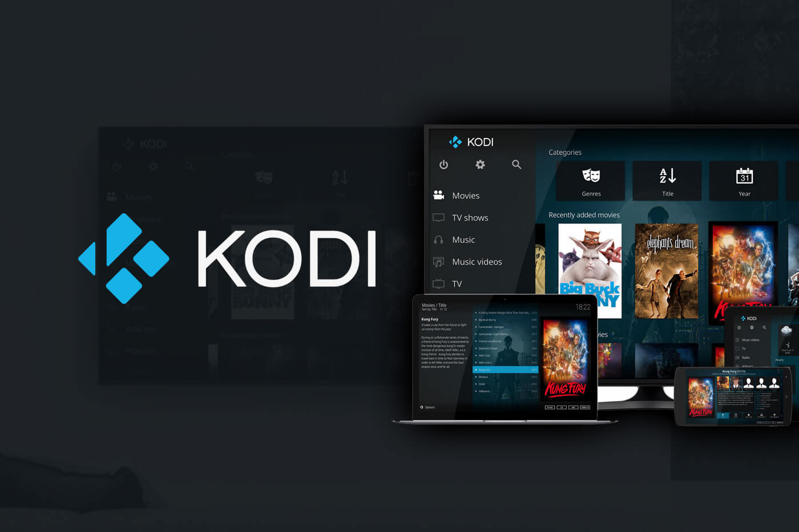

# Kodi 插件推荐

## Kodi 插件库下载

- Chinese Add-ons [repository.xbmc-addons-chinese-1.2.1.zip](https://t00y.com/file/15911488-391805376)
- HDPfans中文插件库 [repository.hdpfans.xbmc-addons-chinese.zip](https://t00y.com/file/15911488-391813254)

## Kodi 视频插件目录：

- 5ivdo(5ivdo) - plugin.video.5ivdo - Online video from www.5ivdo.com
- 亚洲电视 - plugin.video.asia-tv - Live TV channels, include Mainland China, Hong Kong and Taiwan
- 百度云(BaiDuYun) - plugin.video.bdyun - Personal Cloud Storage from yun.baidu.com
- 哔哩哔哩(bilibili) - plugin.video.bilibili - Online video from www.bilibili.com
- 哔哩哔哩(bilibili2) - plugin.video.bilibili2 - Another plugin for online video from www.bilibili.com
- CNTV Live 中国网络电视台直播 - plugin.video.cntv-live - TV live channels from www.cntv.cn
- 央视重播 CCTV Replay - plugin.video.cntv-replay - An other addon for TV live channels from www.cntv.cn
- 多瑙影院播放器(dnvodPlayer) - plugin.video.dnvodPlayer - Search and play movie on www.dnvod.eu
- 斗鱼TV(douyutv) - plugin.video.douyutv2 - Online videos from www.douyutv.com
- 风行视频(Funshion) - plugin.video.funshion - Online videos from www.funshion.com
- 酷6云中剧场(Ku6) - plugin.video.ku6 - Online video from www.juchang.com
- 乐视网(LeTV) - plugin.video.letv - Online video from www.letv.com.cn
- 美剧猫(meijumao) - plugin.video.meijumao - online video from www.meijumao.net
- PPS影音(PPS.tv) - plugin.video.pps - Video from PPS for client side playback
- PPS网络电视(PPStream) - plugin.video.ppstream - PPS online tv and movies
- PPTV视频 - plugin.video.pptv - Online videos from www.pptv.com
- 奇艺视频(QIYI) - plugin.video.qiyi - Online videos from www.iqiyi.com
- 人人美剧 - plugin.video.rrmj - US TV series from www.rrmj.tv
- 搜狐视频(SoHu) - plugin.video.sohuvideo - Online video from tv.sohu.com
- 音悦台MV(YinYueTai) - plugin.video.yinyuetai - MV from www.yinyuetai.com
- 优酷视频(YouKu) - plugin.video.youku - Online tv and movies from www.youku.com
- YouKu TV - plugin.video.youkutv - Online tv and movies from www.youku.com, with wonderful GUI
- 战旗TV(ZhanqiTV) - plugin.video.zhanqitv - Online video from www.zhanqi.tv
 
## Kodi 音乐插件目录：

- 一听音乐 - plugin.audio.1ting - 1ting online music
- 百度随心听 - plugin.audio.baidufm - Baidu FM music
- 百度电台联盟(BaiduRadio) - plugin.audio.baiduradio - Baidu radio
- 豆瓣FM(DoubanFM) - plugin.audio.doubanfm - Douban FM music
- 酷狗电台(KugouFM) - plugin.audio.kugoufm - Kugou FM music
- 酷我音乐盒(KuwoBox) - plugin.audio.kuwobox - KuwoBox online music
- 中国广播(Radiocn) - plugin.audio.radiocn - Radio.cn radio

## Kodi 程序插件目录：

- IPTV Tool - script.iptvtool - Automatic setting PVR IPTV Simple Client with chinese channels.
- Skin Font - script.skinfont - Add arial font type to any skin for display chinese characters.

## Kodi 字幕插件目录：

- Shooter(Fake) - service.subtitles.makedie - Search and download subtitles from assrt.net
- Sub HD - service.subtitles.subhd - Search and download subtitles from subhd.com
- zimuku - service.subtitles.zimuku - Search and download subtitles from zimuku.cn
- ZiMuZu - service.subtitles.zimuzu - Search and download subtitles from zimuzu.tv
- ZMS - service.subtitles.zimushe - Search and download subtitles from zimushe.com

## Kodi电视刮削器目录：

- doubantv - metadata.doubantv.com - Download TV information from movie.douban.com

## Kodi 安装插件教程

Kodi含有非常丰富的插件，通过安装插件可实现许多你意想不到的强大功能。
可以通过三种方法安装插件：它自带一个英文插件库，可以搜索安装；也可以从网上找到插件导入安装；还可以添加「Kodi插件库」，从插件库里面安装插件。

### 方法一：Kodi 搜索安装插件

1. 打开Kodi，点击“插件”进入插件管理页面，然后点击左上角的图标。
2. 选择“搜索”，输入关键词，找到需要的插件，点击安装即可。

稍等一会安装完毕后就可以去“插件”-“我的插件”里面找到刚刚安装的插件。

### 方法二：安装单独下载的zip插件

首先下载插件，一般插件文件是个zip格式的压缩包，文件下载后不要解压，如果是安装到手机/平板或电视盒上的 Kodi，请把文件拷贝到该设备中。

1. 打开Kodi，点击“插件”进入插件管理页面，然后点击左上角的图标。
2. 选择“从zip文件安装”
3. 安全起见，Kodi默认不允许自己安装未知来源的插件
4. 进系统设置，“插件”- 勾选“未知来源”
5. 找到放置插件文件的路径，点击“确定”开始安装

### 方法三：Kodi 插件库添加插件方法

kodi自带一个英文插件库，里面插件很多，但是并没有中文版的插件库，除了Kodi自带的插件库外，可以自己添加由国人维护的「Kodi中文插件库」，这些中文插件库里面就包含了各种适合国情的中文插件，其中就有一些中文字幕插件。
下载Kodi中文插件库“xbmc-addons-chinese”“HDPfans中文插件库”，安装库的方法同上面的安装zip插件方法

1. 打开Kodi，点击“插件”进入插件管理页面，然后点击左上角的图标。
2. 选择“从库安装”
3. 以 “Chinese Add-ons” 中文库为例，点击进入后，选择「字幕」一类，就能看到 Sub HD、zimuku 字幕库等字幕网站的插件了，按喜欢选择安装即可。